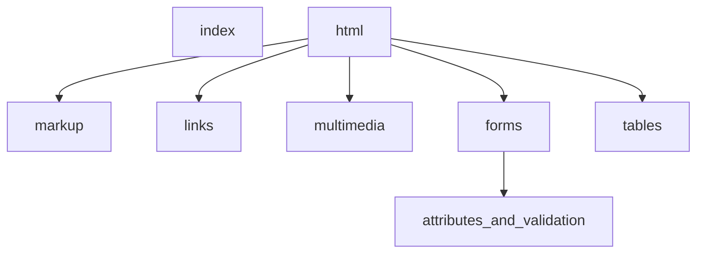

1. [x] add folders:
    1. [x] project
        1. [x] html
            1. [x] html
            1. [x] css
            1. [x] js
1. [x] add template.html
    1. [x] create file
    1. [x] add basic html structure
1. [x] commit
## navbar diagram

1. [x] add navbar to template.html
    1. [x] links
        1. [x] index
        1. [x] html (no link)
            1. [x] markup
            1. [x] links
            1. [x] multimedia
            1. [x] forms
                1. [x] attributes_and_validation
            1. [x] tables
1. [x] commit
1. [x] template; fix syntax error viewport settings
1. [x] commit
1. [x] template; fix navbar
1. [x] commit
1. [x] add html pages for html section:
    1. [x] index
    1. [x] markup
    1. [x] links
    1. [x] multimedia
    1. [x] forms
    1. [x] attributes_and_validation
    1. [x] tables
1. [x] commit
1. [x] modify links in template
1. [x] commit
1. [x] copy template to empty html files
    1. [x] index
    1. [x] markup
    1. [x] links
    1. [x] multimedia
    1. [x] forms
    1. [x] attributes_and_validation
    1. [x] tables
1. [x] commit
1. [x] modify website title in html files
    1. [x] template
    1. [x] index
    1. [x] markup
    1. [x] links
    1. [x] multimedia
    1. [x] forms
    1. [x] attributes_and_validation
    1. [x] tables
1. [x] commit
1. [x] modify index.html
    1. [x] head section
        1. [x] title
    1. [x] body section
        1. [x] main section
            1. [x] page heading
            1. [x] content
1. [x] commit