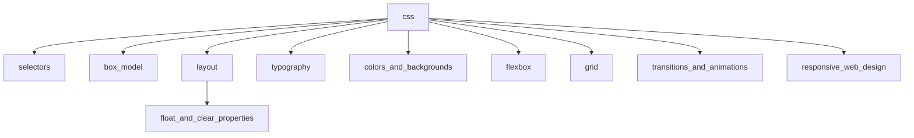

1. [x] 13.md
    1. [x] add
    1. [x] modify
    1. [x] commit
1. [x] push
1. [x] modify tables.html
    1. [x] head section
        1. [x] title
    1. [x] body section
        1. [x] main section
            1. [x] page heading
            1. [x] commit
            1. [x] content
                1. [x] code
                1. [x] output
                1. [x] test
                1. [x] commit
1. [x] push
1. [x] form_validation.md
    1. [x] fix typo pattern;code section
    1. [x] commit
1. [x] add lazy loading to image in link.html
    1. [x] commit
## navbar diagram

1. [x] add html pages for css section:
    1. [x] selectors
    1. [x] box_model
    1. [x] layout
    1. [x] float_and_clear_properties
    1. [x] typography
    1. [x] colors_and_backgrounds
    1. [x] flexbox
    1. [x] grid
    1. [x] transitions_and_animations
    1. [x] responsive_web_design
1. [x] commit
1. [x] template.html
    1. [x] navbar
        1. [x] fix typo
        1. [x] add css pages
            1. [x] selectors
            1. [x] box_model
            1. [x] layout
                1. [x] float_and_clear_properties
            1. [x] typography
            1. [x] colors_and_backgrounds
            1. [x] flexbox
            1. [x] grid
            1. [x] transitions_and_animations
            1. [x] responsive_web_design
        1. [x] test
        1. [x] commit
1. [x] modify navbar in html .html pages
    1. [x] index
    1. [x] markup
    1. [x] links
    1. [x] multimedia
    1. [x] forms
    1. [x] form_validation
    1. [x] tables
1. [x] test
1. [x] commit
1. [x] copy template to empty html files and modify links
    1. [x] selectors
    1. [x] box_model
    1. [x] layout
        1. [x] float_and_clear_properties
    1. [x] typography
    1. [x] colors_and_backgrounds
    1. [x] flexbox
    1. [x] grid
    1. [x] transitions_and_animations
    1. [x] responsive_web_design
1. [x] test
1. [x] commit